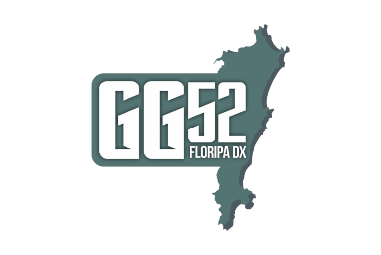

<p align="center">
  
</p>

<h1 align="center">📖 Manual N1MM+ em Português</h1>

<p align="center">
  <strong>Tradução não-oficial e comunitária do manual do N1MM Logger+ para PT-BR</strong>
  <br>
  <sub>Um projeto <a href="https://gg52floripadx.com/"><strong>GG52 Floripa DX</strong></a> · iniciativa de <a href="https://pp5kj.com"><strong>PP5KJ</strong></a></sub>
</p>

<p align="center">
  
  
  
  
</p>

<p align="center">
  <a href="#-sobre-o-projeto">Sobre</a> ·
  <a href="#-o-que-já-está-traduzido">O que tem traduzido</a> ·
  <a href="#-recursos-do-site">Recursos</a> ·
  <a href="#-deploy-automático-github-actions--hostgator">Deploy</a> ·
  <a href="#-rodando-localmente">Rodar localmente</a>
</p>

<br>

## 📖 Sobre o projeto

O **N1MM Logger+** é um dos softwares de log para contest mais usados por radioamadores no mundo
todo — mas a documentação oficial existe só em inglês. Este projeto traduz o manual para o
**português do Brasil**, mantendo os termos de interface do programa (nomes de menus, campos e
diálogos) exatamente como aparecem na tela, já que o próprio N1MM+ não tem uma interface
totalmente localizada.

> Tradução voluntária, feita por operadores para operadores. Sem vínculo com o N1MM Logger+ Team —
> o conteúdo original é de autoria deles, disponível em [n1mmwp.hamdocs.com](https://n1mmwp.hamdocs.com/).

## ✅ O que já está traduzido

A seção **Setup** do manual está **100% completa** (10 páginas) e a seção **Getting Started** está em andamento (4 de 9 páginas traduzidas):

| | Página | Conteúdo |
|---|---|---|
| 📦 | Software Setup | Instalação, múltiplos indicativos e configurações |
| 🎛️ | The Configurer | Hardware, portas, PTT, modos digitais, Winkeyer, antenas |
| 🏆 | Contest Setup Dialog | Bancos de dados, logs e categorias Cabrillo |
| ⌨️ | Keyboard Shortcuts | Todos os atalhos de teclado do programa |
| 🧩 | Function Keys & Macros | Mensagens de CW/SSB/RTTY e a referência de macros |
| 🎙️ | Audio Setup Window | Áudio, monitoramento de CW e texto-para-voz |
| 🎨 | Skins, Colors and Fonts | Aparência do programa: cores, fontes e skins |
| 🔌 | Interfacing | Cabos, CW/PTT, antenas e controle de rotor |
| 🌐 | Localization | Como traduzir a própria interface do N1MM+ |
| 🕘 | Call History | Histórico de indicativos e consulta reversa |

**Getting Started** (em tradução — 4 de 9 páginas):

| | Página | Status |
|---|---|---|
| 📚 | Introduction | ✅ Completo |
| ⬇️ | Downloading the Software | ✅ Completo |
| 🔧 | Downloading Digital Software | ✅ Completo |
| 🆘 | Finding Help | ✅ Completo |
| ⚙️ | Installing and Upgrading N1MM Logger+ | ⏳ Em progresso |
| 🔌 | Interfacing Basics | ⏳ Em progresso |
| 🧭 | Learning Your Way Around | ⏳ Em progresso |
| 📋 | Setting up for a Contest | ⏳ Em progresso |
| 🎙️ | Operating a Contest | ⏳ Em progresso |

As demais seções do manual completo (Supported Contests Setup, Operating Modes, Appendices e FAQ) ainda não foram traduzidas.

## ✨ Recursos do site

- 🎨 **Design moderno** — hero em gradiente com onda animada, cards com ícones, inspirado na home oficial do N1MM+
- 🔒 **Proteção de conteúdo** — bloqueio dissuasório de cópia, seleção de texto e impressão
- 📊 **Analytics** via Microsoft Clarity
- ⚡ **Zero build step** — HTML/CSS/JS puro, sem dependências, sem framework
- 🚀 **Deploy automático** para a HostGator via GitHub Actions a cada push
- 📱 **Open Graph + Twitter Cards** — preview otimizado ao compartilhar no WhatsApp, Telegram, redes sociais
- 💰 **Monetização** — preparado para Google AdSense (temporariamente desabilitado, será ativado quando a conta for desbloqueada)

## 🚀 Deploy automático (GitHub Actions → HostGator)

Todo push para `main` que altere algo em [`site/`](site/) publica automaticamente via FTP/FTPS,
usando [`.github/workflows/deploy.yml`](.github/workflows/deploy.yml).

<details>
<summary><strong>⚙️ Configuração necessária (Settings → Secrets and variables → Actions)</strong></summary>
<br>

**Secrets** (obrigatórios):

| Nome | Valor |
|---|---|
| `FTP_SERVER` | Host FTP da HostGator (ex.: `ftp.gg52floripadx.com`, disponível no cPanel em **Contas FTP**) |
| `FTP_USERNAME` | Usuário da conta FTP criada no cPanel |
| `FTP_PASSWORD` | Senha dessa conta FTP |

**Variable** (opcional):

| Nome | Valor |
|---|---|
| `FTP_SERVER_DIR` | Pasta de destino no servidor. Se não definida, usa o padrão `/home2/vini0792/n1mm.gg52floripadx.com/` já configurado no workflow |

**Criando a conta FTP no cPanel:**

1. No cPanel da HostGator, abra **Contas FTP**
2. Crie uma conta com **diretório inicial** apontando exatamente para a pasta de destino
3. Se o diretório inicial da conta FTP **já for** essa pasta, defina `FTP_SERVER_DIR` como `./`
   em vez do caminho absoluto — caso contrário o deploy vai tentar criar a pasta dentro dela mesma

> **Nota:** o caminho de destino original foi informado como `.../n1mm.gg52floripadx/com`
> (barra em vez de ponto antes de "com"). Como isso não é um caminho válido, o workflow usa
> `/home2/vini0792/n1mm.gg52floripadx.com/` (com ponto) — confirme se está correto.

</details>

## 💻 Rodando localmente

Não tem build, não tem servidor, não tem dependência. Só abrir:

```
site/index.html
```

direto no navegador.

---

<p align="center">
  <sub>Feito com 📻 por radioamadores, para radioamadores.</sub>
</p>
